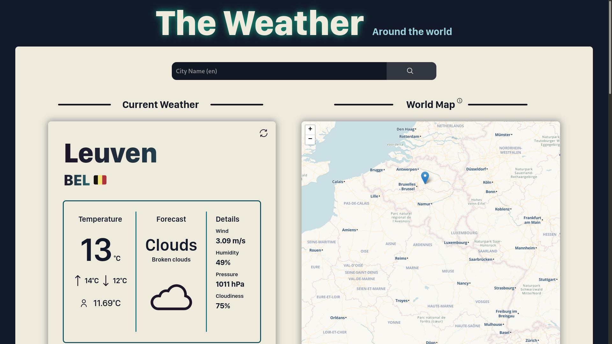
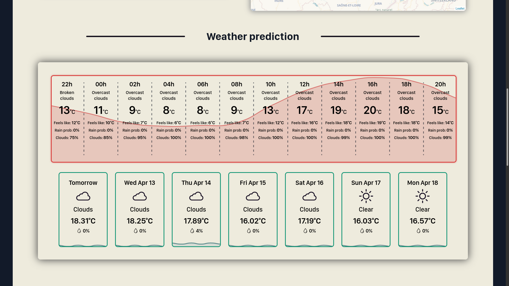
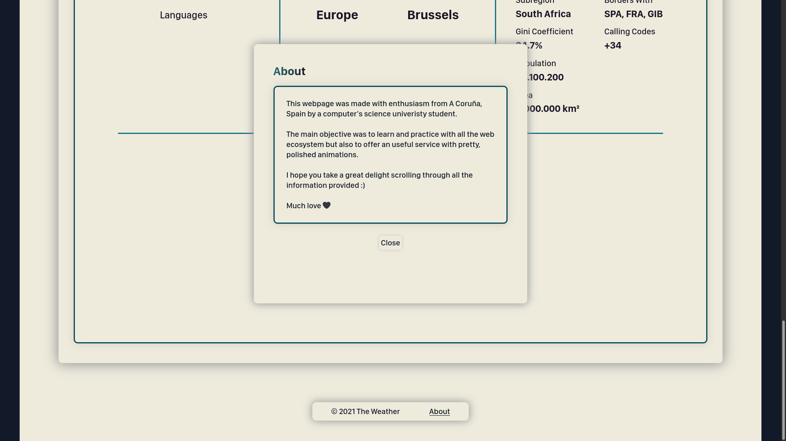

 <h1><strong>Weather Web</strong></h1> 

<strong>&nbsp;P A G E &nbsp; L I N K &nbsp;🌎</strong>

 

[Weather Web](https://weather-web-api.herokuapp.com/)

#

<strong>&nbsp;O V E R V I E W &nbsp;👁️‍🗨️</strong>

 

My first web project :)

A simple web page to see weather forecast around the world. It's made only with raw javascript, css and html.

It uses:
* Chart.js to draw forecast charts
* Some APIs like: [Openweather](https://openweathermap.org/), [CountryLayer (now paid)](https://countrylayer.com/), [Worldbank](https://www.worldbank.org/en/home) and [MapTiler](https://www.maptiler.com/)

**Note:** The country info section is not longer working because the free API that was used to get that info is now paid.

#

<strong>&nbsp;S C R E E N S H O T S &nbsp;📸</strong>

 

